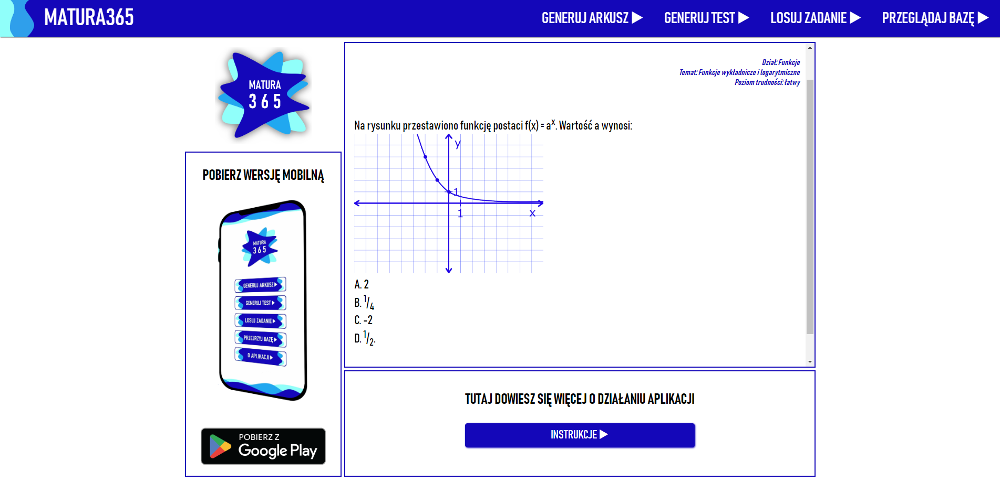

# Matura365 - math test generator 
#### [Click for live version](https://www.matura365.pl)

## Table of contents
* [General info](#general-info)
* [Technologies](#technologies)
* [Setup](#functionalities)

## General info
Matura365 is a simple app for generating math tests and exemplary matura exams for students. The questions are randomly chosen from a collection of Json files (ommited in this repository in order to protect my copyright).

## Technologies
Project is a static website created with:
* HTML/CSS
* JS Fetch API (for fetching the Json files)

## Functionalities
* Tests - based on the supplied criteria (difficulty, number of questions, and the topic) the app generates a math test
* Matura Exams - the app generates one of the three available Matura Exam formulas. The algorithms responsible for choosing topics are developed on the basis of past exams. 
